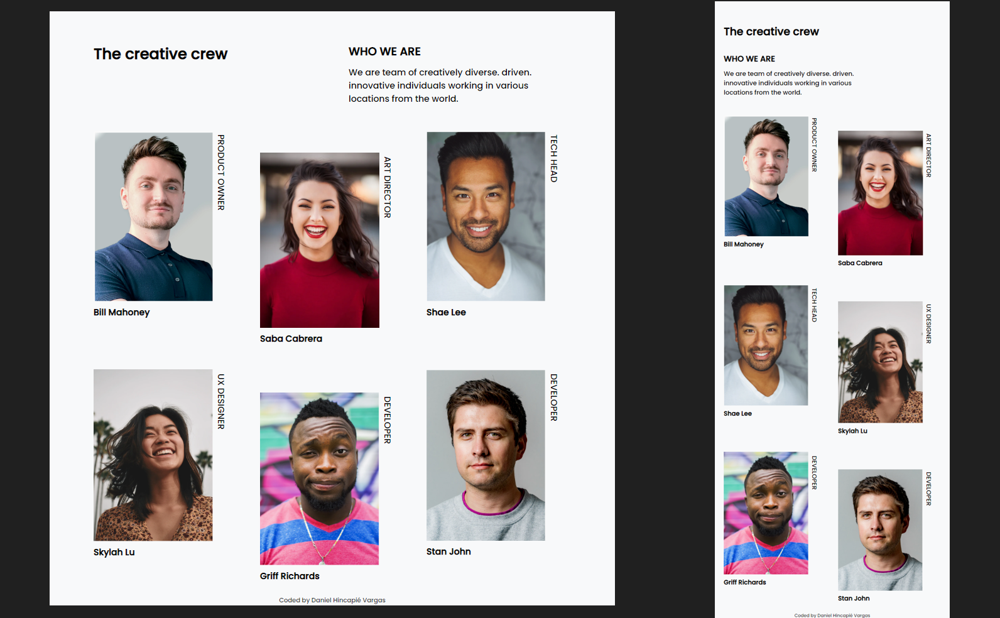

# Make It Real - My Team page

This is a solution to the my-team-page project of the Make It Real course.

## Table of contents

- [Overview](#overview)
  - [The challenge](#the-challenge)
  - [Screenshot](#screenshot)
- [My process](#my-process)
  - [Built with](#built-with)
  - [What I learned](#what-i-learned)
  - [Continued development](#continued-development)
  - [Useful resources](#useful-resources)
- [Author](#author)


## Overview

### The challenge

Users should be able to:

- The user should be able to view My Team page on both a mobile device and a desktop computer.

### Screenshot




## My process

### Built with

- Semantic HTML5 markup
- CSS custom properties
- Sass
- Flexbox
- Mobile-first workflow

### What I learned

I learn how to define variables in Sass:
```scss
$font-stack: 'Poppins', sans-serif;
$primary-color: #000000;
$hover-color: #cf649a;
$font-big: 18px;
$font-small: 14px;
```
I also learned how to nest:
```scss
.attribution{
    color: #333;
    text-align: center;
    font-size: 10px;
    a{
        text-decoration: none;
        color: inherit;
        &:hover{
            color: $hover-color;
        }
    }  
}
```

I used the BEM methodology to create modifiers for some elements in different media queries:
```html
<div class="container__card container--second-layout container--third-layout">
  <figure>
    
    <figcaption>Saba Cabrera</figcaption>
    <span>ART DIRECTOR</span>
  </figure>
</div>
```

### Continued development

I didn't see the opportunity to use Modules or Mixins. I hope to be able to implement them in future projects to practice and learn more about them.

### Useful resources

- [Sass's guide page](https://sass-lang.com/guide) - On this page, I was able to refer to the basic syntax of what I used in Sass.


## Author

Daniel Hincapié Vargas

